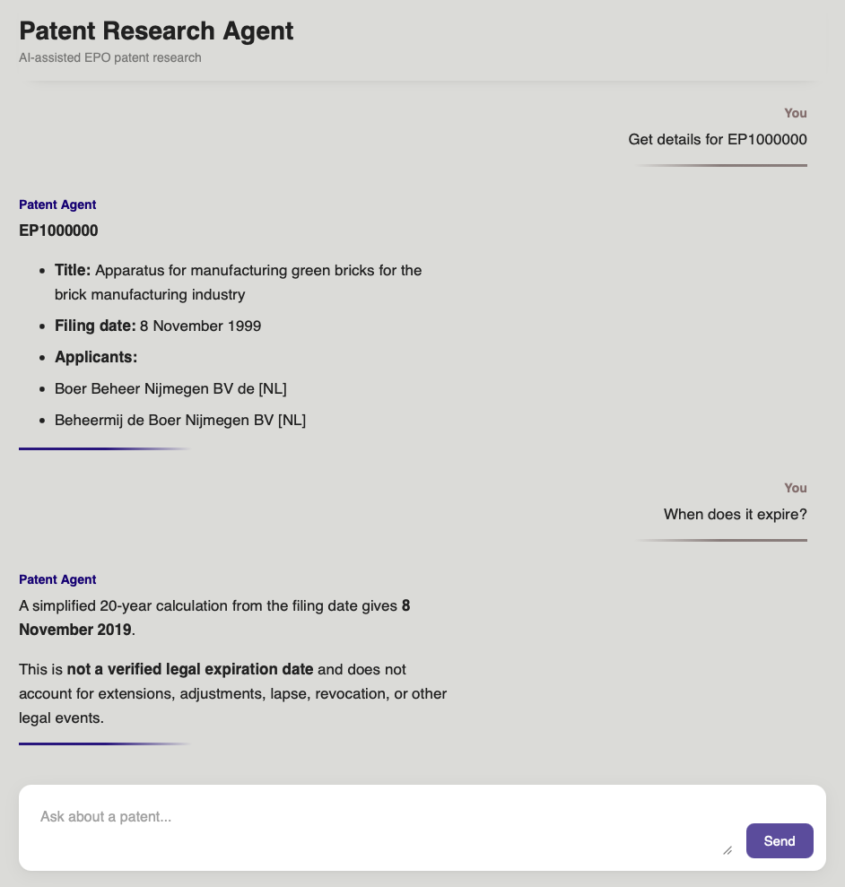

# Patent Research Agent

[](https://github.com/skykamil/patent-agent/actions/workflows/tests.yml)

A deployed patent research agent that answers natural-language questions using live data from the EPO OPS API. It uses raw OpenAI Responses API function calling, without an agent framework, and supports patent search, bibliographic lookup, multi-step tool use, and persistent conversations.

**Live demo:** https://patentagent.mooo.com

> This is an educational project and portfolio prototype, not a production or legal-status tool.



## Status

The project includes a FastAPI HTTP API, a browser chat interface, SQLite conversation persistence and observability, Docker deployment on AWS EC2, and HTTPS through Caddy.

The agent currently uses three tools: EPO patent search, EPO bibliographic lookup, and a local simplified 20-year patent-term calculation. Requests are protected by runtime limits, rate limits, persistent daily usage limits, and process-local per-conversation locking.

Version history and release-specific changes are kept in [GitHub Releases](https://github.com/skykamil/patent-agent/releases).

## Tools

| Tool | Type | Parameters | Returns |
| --- | --- | --- | --- |
| `search_patent` | EPO OPS (published-data search) | `ti`, `pa`, `pn`, `ap`, `pd_from`, `pd_to`, `page` — all optional | Up to 25 publication numbers plus `total_results`, `page`, `total_pages`, `available_pages`, and `truncated` |
| `get_patent_details` | EPO OPS (published-data biblio) | `pn` — required | `publication_number`, `filing_date`, `title`, `applicants` |
| `expiration_date` | Local computation | `filing_date` — required | Simplified filing date + 20 years, `YYYYMMDD` |

`expiration_date` is deliberately a local, non-API tool, so that the model has to choose between *kinds* of tools rather than between similar API wrappers.

All three schemas use `"strict": true`, which requires every property to be listed in `required`; optionality is expressed by allowing `null` alongside the parameter's actual type.

## Requirements

- Python 3.12+ (tested on 3.14)
- OpenAI API key
- EPO OPS consumer key and secret (free registration at the [EPO developer portal](https://developers.epo.org/))
- Docker Desktop or Docker Engine (for containerized usage)

## Tech Stack

- Python
- OpenAI Responses API (`gpt-5.6-luna`), raw function calling — no agent framework
- EPO OPS 3.2 REST API (OAuth2 client credentials, CQL search)
- `requests`
- Tenacity
- `xml.etree.ElementTree` (standard library — chosen over `lxml`, since only a handful of fields are read)
- SQLite3
- FastAPI
- Pydantic
- Uvicorn
- Docker
- Vanilla HTML, CSS, and JavaScript

## Installation

1. Clone the repository:

    ```bash
    git clone https://github.com/skykamil/patent-agent.git
    cd patent-agent
    ```

2. Install dependencies:

    ```bash
    pip install -r requirements.txt
    ```

3. Create your local environment file from the provided template:

    ```bash
    cp .env.example .env
    ```

    Then fill in your credentials in `.env`:

    ```text
    OPENAI_API_KEY=your-key-here
    EPO_CONSUMER_KEY=your-epo-key-here
    EPO_CONSUMER_SECRET=your-epo-secret-here
    ```

## Usage

Running the script starts an interactive REPL:

```bash
python3 patent_agent.py
```

Each prompt shows three options:

```
N - New chat
E - Exit
How can I help you?
```

Type a natural-language question to have the agent answer it. Conversation history persists across turns within a session, so follow-up questions can refer to a previous answer without repeating details (e.g. asking "when will it expire?" after already looking up a patent's filing date). `N` clears the history and starts a new `run_id` for logging; `E` exits the program.

To run the eval harness instead of the REPL:

```bash
python3 patent_agent.py --eval
```

This executes the fixed 11-case eval set and prints separate tool-call and final-response scores.

### HTTP API

Start the development server:

```bash
uvicorn api:app --reload
```

The browser chat interface is available at:

```text
http://127.0.0.1:8000/
```

A dedicated health endpoint is available at:

```text
http://127.0.0.1:8000/health
```

Interactive OpenAPI documentation and request testing are available at:

```text
http://127.0.0.1:8000/docs
```

Start a new conversation by sending a request without a `conversation_id`:

```json
{
  "message": "Get details for publication number EP1000000"
}
```

The response contains the agent answer and a generated conversation ID:

```json
{
  "answer": "...",
  "conversation_id": "..."
}
```

To continue the same conversation, send the returned ID with the next request:

```json
{
  "message": "When will it expire?",
  "conversation_id": "..."
}
```

Conversation history is persisted in SQLite and can be restored after the API process restarts.

The API returns HTTP status codes for known failure modes: `404` for an unknown conversation, `409` when the same conversation is already being processed, `413` for oversized conversation history, `422` for request validation, `429` for local or upstream rate limits, `500` for internal application failures, `502` for invalid/upstream responses, `503` for unavailable upstream services, and `504` for upstream timeouts.

`POST /chat` accepts messages up to 5,000 characters and conversation IDs up to 64 characters. Before each agent run, serialized conversation history plus the new user message is capped at 100,000 characters.

`POST /chat` is additionally protected by a per-IP limit of 10 requests per 10-minute sliding window and a persistent global limit of 50 requests per day that may reach agent execution. The per-IP counter is process-local and is checked near the start of the route. The daily counter is stored in SQLite, incremented immediately before agent execution, and resets at midnight in the `Europe/Warsaw` timezone. Requests admitted to agent execution consume one daily slot even if the agent run later fails, including because of an upstream error.

Transient EPO timeouts, connection errors, HTTP 429 responses, and HTTP 5xx responses are retried up to three total attempts. For HTTP 429, `Retry-After` is honored in both delay-seconds and HTTP-date formats, up to 60 seconds; longer requested waits fail immediately.

OpenAI requests use a 60-second timeout and the SDK's built-in retry behavior with `max_retries=2`.

### Docker

Build the image:

```bash
docker build -t patent-agent .
```

Create a named volume for persistent SQLite data:

```bash
docker volume create patent-agent-data
```

Run the API container with runtime credentials and persistent SQLite storage:

```bash
docker run --rm --name patent-agent-api --env-file .env -e DATABASE_PATH=/data/logs_db.db --mount type=volume,src=patent-agent-data,dst=/data -p 127.0.0.1:8000:8000 patent-agent
```

The API port is bound to `127.0.0.1` on the host rather than exposed directly to the Internet.

The container stores SQLite data at `/data/logs_db.db`. The `/data` directory is backed by the `patent-agent-data` named volume, so conversation history, tool logs, request-level observability logs, retry logs, and the persistent daily-usage counter survive container removal and recreation. Without the volume, the database exists only in the container's writable layer and is lost when the container is removed.

### Deployment

The public demo runs on AWS EC2 in Docker. `scripts/deploy.sh` pulls the latest repository state, rebuilds the image, and recreates the `patent-agent-api` container.

Application secrets are loaded at deployment time from AWS Systems Manager Parameter Store and are not stored in the repository. Production SQLite data is stored at `/data/logs_db.db`, with the host `/data` directory mounted into the container so conversations, logs, and usage counters survive container replacement.

The FastAPI container is exposed only on `127.0.0.1:8000`. Caddy handles public HTTP/HTTPS traffic, automatic TLS, and reverse proxies requests to the application.

## Evaluation

The eval set contains 11 cases covering all three tools, including a two-tool chain, open-ended and bounded date ranges, pagination, and an unrelated API developer portal request. For the unrelated request, the harness expects no tool calls and checks that the answer contains "patent"; this is a basic scope check, not a complete verification of refusal behavior.

### Tool-call evaluation

A case passes only if the *entire* expected call sequence matches: the number of calls, the tool names in order, and the expected arguments as a subset of the actual ones (`expected.items() <= actual.items()`, which tolerates the `null` values forced by `"strict": true`).

### Final-response evaluation

The final response is checked deterministically rather than with an LLM judge.

For stable cases, the harness checks required response content. For `search_patent`, it validates the answer against the actual tool output from that run: every returned publication number must be present, the reported page must match `page X of Y`, the total result count and accessible page count must appear, and truncated result sets must mention the 2,000-record OPS retrieval limit.

If a case expects `search_patent` but no corresponding tool output is returned, it remains included in the final-response score denominator and is counted as a failure.

The expiry case additionally requires language making clear that the calculated date is simplified and not a verified legal expiration date.

Automated tests last verified on **2026-09-20**: **24 passed**.

Last verified on **2026-09-19**:

- **Tool-call eval: 11/11**
- **Final-response eval: 11/11**

The harness does not independently verify that EPO OPS data itself is correct, and it is not a legal-status validator. It checks whether the agent selected the expected tools and whether its final answer reflects the returned tool data and required caveats.

## Logging, Observability, Conversation Persistence, and Usage Limits

Tool-call execution is logged to `agent_logs` in the SQLite database configured by `DATABASE_PATH`. If `DATABASE_PATH` is not set, the application defaults to `logs_db.db` in the current working directory:

| Column | Description |
| --- | --- |
| `id` | Autoincrement primary key |
| `run_id` | UUID4 used to group related tool-call log rows. In the REPL it identifies the whole conversation until `N` starts a new one; in the FastAPI layer a new `run_id` is created for each `POST /chat` request that passes the per-IP limiter. |
| `timestamp` | ISO 8601, local time |
| `user_input` | The original natural-language question |
| `tool_name` | Which tool was called |
| `arguments` | Arguments the model supplied, as a JSON string |
| `tool_output` | What the tool returned, as a JSON string |
| `status` | `success`, `network_error`, `parse_error`, `error`, or `no_tool_call` |
| `error_message` | Exception text, `NULL` on success |
| `final_response` | The model's final text answer for completed turns; `NULL` if execution failed before a final response was produced |

`run_id` makes it possible to reconstruct a multi-step chain after the fact — for example `get_patent_details` followed by `expiration_date`, sharing one `run_id` across two rows. For completed tool calls, the row is updated with the model's final response for that turn, so it shows both the tool call and the text the model ultimately gave the user. Rows logged immediately before a propagated failure can retain a `NULL` `final_response`.

Request-level API observability is stored separately in the `request_logs` table:

| Column | Description |
| --- | --- |
| `id` | Autoincrement primary key |
| `run_id` | UUID4 for the request run; `NULL` when the request is rejected before a run ID is created |
| `conversation_id` | API conversation ID when available |
| `timestamp` | ISO 8601 timestamp recorded when the request log is written |
| `status_code` | Final HTTP status associated with the request |
| `latency_ms` | End-to-end route execution time in milliseconds |
| `error_type` | Classified internal error type; `NULL` on success |
| `error_message` | Error detail or exception text; `NULL` on success |
| `input_tokens` | Sum of OpenAI input tokens reported by successful Responses API calls during the request |
| `output_tokens` | Sum of OpenAI output tokens reported by successful Responses API calls during the request |
| `total_tokens` | `input_tokens + output_tokens` |

A `request_logs` row is written from the route's `finally` block, so successful requests and handled failures are both recorded. Requests rejected by FastAPI/Pydantic request-model validation before `chat()` executes, such as HTTP `422`, are not currently included.

For requests that reach agent execution, `request_logs.run_id` matches the `run_id` used by `agent_logs`, allowing request-level latency, errors, and token usage to be correlated with individual tool calls. `conversation_id` additionally allows multiple HTTP requests belonging to the same persisted conversation to be traced together.

EPO retry events are stored separately in the `retry_logs` table:

| Column | Description |
| --- | --- |
| `id` | Autoincrement primary key |
| `run_id` | Request run ID used to correlate the retry with request and tool-call logs |
| `tool_call_id` | OpenAI function-call ID for the tool invocation that triggered the retry |
| `tool_name` | Agent tool being executed |
| `timestamp` | ISO 8601 timestamp recorded when the retry is logged |
| `service` | External service being retried; currently `EPO` |
| `attempt` | Attempt number after which another retry will occur |
| `reason` | Retry reason, such as `HTTP 500`, `HTTP 429`, `Timeout`, or `ConnectionError` |
| `wait_seconds` | Delay before the next attempt |

Retry logging is treated as non-critical observability: SQLite logging failures are suppressed so that a logging problem does not interrupt the underlying retry sequence.

`agent_logs` still does not store `conversation_id` directly, but API requests can now be correlated through `request_logs`: `conversation_id` groups requests belonging to the same conversation, while the shared `run_id` links a request to its tool-call rows when agent execution occurs.

Persistent API conversation state is stored in the `conversations` table:

| Column | Description |
| --- | --- |
| `conversation_id` | Primary key identifying one multi-turn API conversation |
| `history` | Serialized Responses API conversation history stored as JSON text |
| `created_at` | ISO 8601 timestamp set when the conversation is first stored |
| `updated_at` | ISO 8601 timestamp refreshed when the conversation history is updated |

Daily API usage is tracked separately in the `daily_usage` table:

| Column | Description |
| --- | --- |
| `day` | Calendar day in `YYYY-MM-DD` format, calculated using the `Europe/Warsaw` timezone |
| `request_count` | Number of daily agent-execution slots successfully consumed on that day |

The daily counter is updated using a single atomic SQLite UPSERT. If the current count is below the configured limit, the row is inserted or incremented and the request is allowed to continue. Once the limit is reached, SQLite leaves the row unchanged and the API returns HTTP `429`. Because the counter is stored in the same persistent SQLite database as conversations and tool logs, it survives application and container restarts.


## Project Structure

| File | Description |
| --- | --- |
| `patent_agent.py` | CLI entry point. Runs the interactive REPL by default and the evaluation harness with `--eval`. |
| `agent.py` | OpenAI Responses API client and tool-calling loop, including runtime/tool-call limits, tool execution, token usage tracking, and tool-call logging. |
| `epo_client.py` | EPO OPS client: OAuth2 authentication, HTTP requests, retry/backoff behavior, retry observability, XML parsing, patent search, and bibliographic lookup. |
| `tools.py` | OpenAI tool schemas and the local `expiration_date` calculation. |
| `errors.py` | Custom application and EPO exception hierarchy used across the agent, API, and EPO client layers. |
| `evals.py` | Fixed 11-case evaluation set and evaluation harness for tool-call behavior and final responses. |
| `chat_service.py` | API conversation service layer: history loading, preparation, serialization, persistence, agent execution, and process-local per-conversation concurrency protection. |
| `api.py` | FastAPI application, request/response models, HTTP error mapping, per-IP and daily limits, request-level observability, and HTTP endpoints. |
| `logs_db.py` | SQLite schema and persistence for tool-call logs, request logs, retry logs, conversations, final-response updates, and atomic daily-usage limiting. |
| `tests/test_retry.py` | Pytest coverage for EPO retry/backoff behavior, `Retry-After` handling, retry observability, and fallback behavior. |
| `tests/test_api.py` | Pytest coverage for conversation persistence and restarts, request validation, unknown conversations, EPO timeout mapping, tool-call history, multipart text and refusal serialization, HTTP 409 and request-log status for busy conversations, and concurrency-guard cleanup and isolation between conversation IDs. |
| `tests/test_evals.py` | Regression test ensuring missing expected search output counts as a failed final response and remains in the score denominator. |
| `static/index.html` | Browser chat interface structure. |
| `static/styles.css` | Chat layout, message styling, composer, and working indicator. |
| `static/app.js` | Browser-side chat behavior, API requests, conversation state, Markdown rendering, keyboard handling, and auto-scroll. |
| `scripts/deploy.sh` | Automated EC2 deployment script. |
| `deploy/caddy/Caddyfile` | Caddy reverse-proxy configuration for public HTTPS. |
| `deploy/systemd/caddy.service` | systemd service definition for running Caddy on EC2. |
| `requirements.txt` | Runtime Python dependencies. |
| `.env.example` | Template showing the environment variables required to run the application, without real secrets. |
| `Dockerfile` | Builds the container image and starts the FastAPI application with Uvicorn. |
| `.dockerignore` | Excludes secrets, local SQLite databases, Git metadata, caches, and development-only files from the Docker build context. |
| `.gitignore` | Excludes `.env`, `*.db`, and `__pycache__/` from the repository. |

## Out of Scope

Deliberately excluded from this project: integration with commercial patent/IP management platforms, multi-agent orchestration, agent frameworks (LangChain and similar), and OPS services other than published-data search and biblio (images, fulltext, family, register, legal, classification, number-service).

## License

MIT — see [LICENSE](LICENSE).

## Limitations

**`expiration_date` is a simplified 20-year arithmetic calculation, nothing more.** It adds 20 years to the filing date and returns the result. It does not account for supplementary protection certificates (SPCs), patent term extensions or adjustments, terminal disclaimers, renewal fee status, or early termination through withdrawal, lapse, revocation, or opposition. The agent is explicitly instructed to present the result as a simplified filing-date-plus-20-years calculation, not as a verified legal expiration date. The output must not be relied on for legal or docketing purposes.

Other known limitations:

- `search_patent` returns publication numbers only — no titles, applicants, or dates. Enriching results requires a separate `get_patent_details` call per number, which the tool description explicitly discourages the model from doing automatically.
- `search_patent` returns 25 records per page. OPS exposes the total hit count but allows retrieval of only the first 2,000 records from a result set, so at most 80 pages are accessible. Broader searches must be narrowed to reach records beyond that limit.
- `get_patent_details` currently accepts publication numbers consisting of a two-letter country code, a numeric publication number, and an optional kind code of one letter with an optional digit. Other publication-number formats are rejected as unsupported.
- Open-ended date ranges are a workaround in Python, not CQL. `pd_from` alone is expanded to a range ending at today's date, meaning the same query can produce different results on different days; `pd_to` alone is expanded to a range starting at the hardcoded constant `19000101`.
- The agent is hard-capped at three tool-execution iterations and 30 tool calls per request. On the final allowed iteration, further tool calls are disabled and the model must produce a final response from the data already collected; exceeding the separate 30-tool-call limit still raises an internal runtime-limit error.
- Within a REPL session, `input_list` grows with every turn and is never trimmed or summarized — long conversations mean larger, costlier prompts on each turn. History resets only on `N` (new conversation) or when the script exits; there is no persistence across separate runs of the script.
- EPO timeouts, connection failures, HTTP 429 responses, upstream 5xx responses, and malformed XML are handled explicitly and propagated to the HTTP layer. Other unexpected tool failures surface as internal server errors.
- The CQL syntax used here was verified empirically against live requests rather than derived from the full documentation. It works for the tested combinations, but is not guaranteed to cover the operators or index names described in the parts of the reference guide that were not reachable.
- The last verified eval scores are 11/11 for tool calls and 11/11 for final responses, but model output is non-deterministic; treat the scores as directional rather than as a guarantee.
- The EPO retry layer and core FastAPI conversation/persistence flows have dedicated pytest coverage. Broader domain-layer unit/integration tests are still limited. The eval harness remains responsible for agent tool-selection and final-response behavior and does not independently verify the correctness of EPO OPS data.
- API conversation history is persisted as JSON in SQLite. The serializer is intentionally tailored to the Responses API item types currently used by this agent rather than being a general-purpose Responses API serializer.
- Request-level observability currently begins inside the validated `POST /chat` route. Requests rejected earlier by FastAPI/Pydantic validation, such as HTTP `422`, are not written to `request_logs`.
- The API currently has no authentication or authorization. Abuse protection consists of a per-IP request limiter and a persistent global daily request cap; it is not a user/account-level quota or identity system.
- The per-IP limiter is a best-effort, process-local safeguard stored only in application memory. It resets when the process or container restarts, is not shared across multiple application workers or instances, and is not synchronized across concurrent requests. The global daily cap is enforced atomically in SQLite and survives restarts and container recreation as long as the persistent database volume is retained.
- Persisted API conversation history is not trimmed, summarized, expired, or automatically cleaned up. However, before an agent run, serialized history plus the new message is capped at 100,000 characters; requests exceeding that limit are rejected with HTTP 413.
- The conversation concurrency guard is process-local. It protects conversations within a single application process, but does not coordinate multiple workers or application instances. Run a single worker to retain this protection.
- Patent-only behavior is instructed through prompting, not enforced by a deterministic topic filter.
- The output-token cap applies separately to each model call and includes reasoning tokens. It is not a total per-conversation budget. Incomplete-response handling has not yet received a dedicated automated test.
- Markdown tables require consistent column counts and do not support literal pipe characters inside cell content. Wide-table horizontal scrolling is implemented but was not verified during this patch's manual checks.
- Final-response pagination checks currently require the phrase `page X of Y`. Correct answers that report the current page and total pages separately can fail this check.
